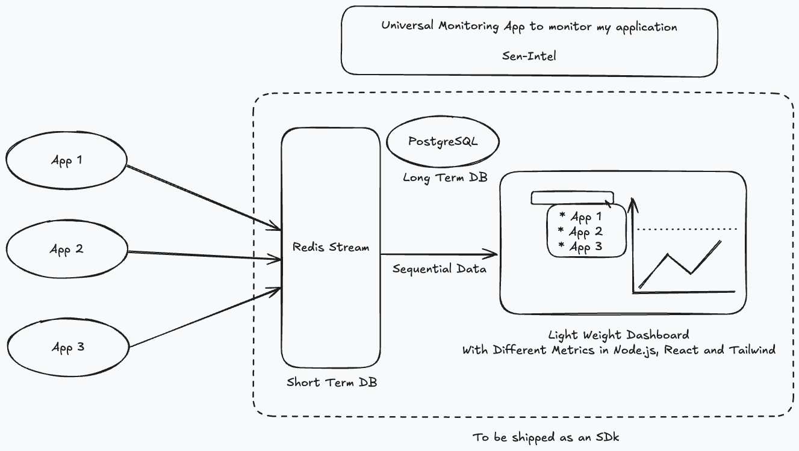

# 📡 SenIntelSDK — Universal Log & API Monitor

SenIntelSDK is a lightweight and pluggable SDK for logging, monitoring, and making API calls — with support for both **local file logging** and **remote server ingestion**.

As I plan to make a lot of apps, monitoring them is gonna be crucial and I want a light weight monitoring system with My own sexy UI. My name is Amik Sen, Hence presenting to you all SenIntel! :applause:

Now this will be built in an iterative manner and I hope anybody (if I am lucky enough) using this is the future, can learn from my mistakes!
Although I hope you make a tons of your own mistakes and learn! :wink:

For Starters I am going with an Architecture pattern as shown below:
Will change this if required and with reasons for the change



Now initially I thought of this central architecture, and this is how I wish to use my SenIntel instance.
But for someone who just wants casual logging and monitoring of performance of your App or API, we can keep a local mode as well! 
So we will have two modes in the SDK:
- `local` - creates a seperate json file in the project itself, and the dashboard uses this file.
- `server` - give the server details and credentials, that will be used as the source for the dashboard.

Currently we don't monitor the latency of an API call in the SDK. 
I was thinking of doing the call through the SenIntel SDK to give SLA information and even interrupt calls if they are taking too much time.

So Based on this with only logging I am giving options to send REST Api requests through the logger to get time and everything! 
In Future if this seems like an over-kill will just remove this!
Also, Usually loggers get system information for logs and files, in case of SenIntel we are directly monitoring the API requests.
I don't understand the issues and stuff! So we will see with time and improvise! :wink:

## 🚀 Installation

```bash
npm install senintel-sdk
# or
yarn add senintel-sdk
```

---

## 🛠️ Usage

### 🔧 Initialize the SDK

```js
import SenIntelSDK from "senintel-sdk";

const monitor = new SenIntelSDK({
  endpoint: "http://localhost:3000",
  app: "AroundMe",
  mode: "server", // or "local"
  localLogPath: "./mylogs" // optional
});
```

---

## 🌐 Make API Calls

### GET

```js
await monitor.get("/config", { user: "admin" });
```

### POST

```js
await monitor.post("/log", { message: "Custom log", level: "info" });
```

### PUT

```js
await monitor.put("/config", { enable: true });
```

### DELETE

```js
await monitor.delete("/logs/old");
```

---

## 📝 Log Events

```js
monitor.log("info", "User logged in", { userId: 123 });
```

### Log Levels
- `info`
- `warn`
- `error`

---

## 💾 Local Mode

In `"local"` mode, logs are saved to:

```
📁 ./logs/SenIntel.json
```

Or to your custom `localLogPath`.

---

## ⚙️ Auto Flush

- Logs are buffered and sent in batch every 5 seconds
- You can flush manually with:

```js
monitor.flush();
```

---

## 🔐 Environment Setup (optional)

Create a `.env` file for setting up the server to send logs:

```env
MONITOR_DB_URL=http://localhost:3000
```

---

